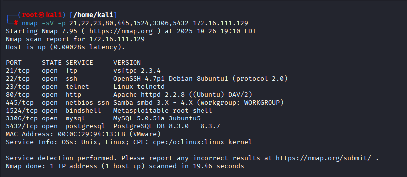
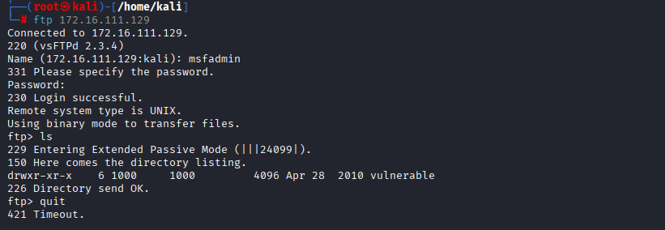
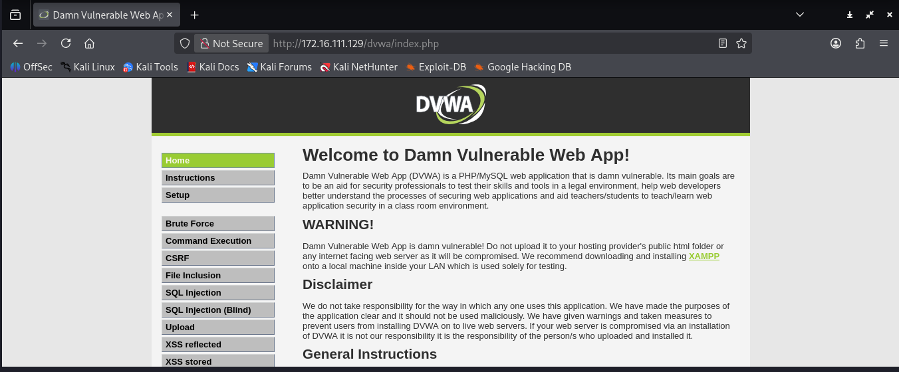
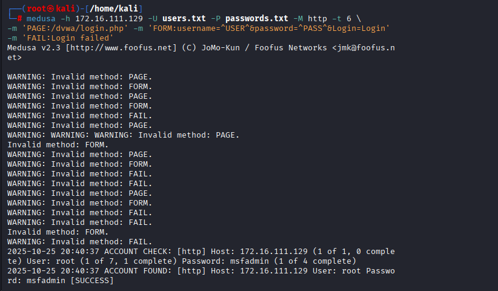
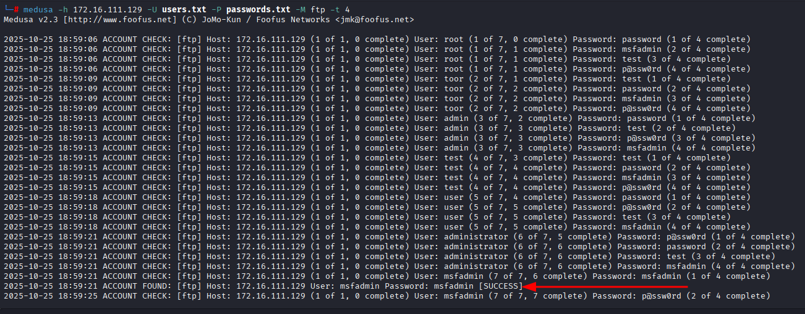
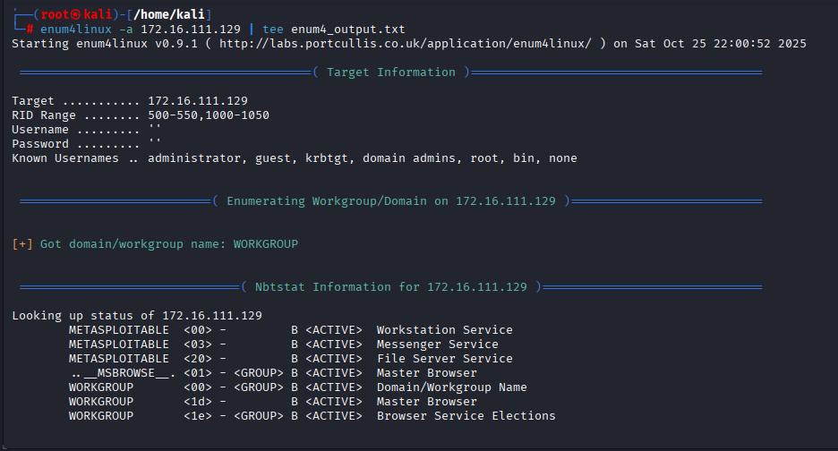
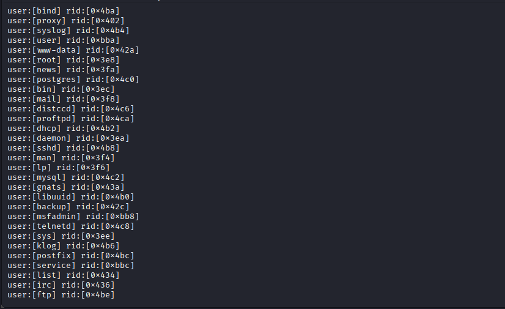

# 🧠 Projeto DIO — Brute Force e Enumeração com Medusa e DVWA

## 📋 Descrição do Projeto

Este projeto foi desenvolvido como parte dos desafios da **Digital Innovation One (DIO)**, com o objetivo de realizar testes de **força bruta e enumeração** em um ambiente controlado de laboratório, utilizando as ferramentas **Medusa**, **Nmap**, **Enum4linux** e a aplicação vulnerável **DVWA (Damn Vulnerable Web App)**.

Todo o ambiente foi configurado em **máquinas virtuais (Kali Linux e Metasploitable 2)**, simulando um cenário de pentest ético para fins educacionais.

---

## 🧱 Estrutura do Laboratório

- **Sistema atacante:** Kali Linux (VMware)
- **Sistema alvo:** Metasploitable 2 (VMware)
- **Rede:** Host-only / NAT (isolada do ambiente real)
- **Ferramentas principais:**
  - `nmap`
  - `ftp`
  - `medusa`
  - `enum4linux`
  - `DVWA`

---

## ⚙️ Etapas da Execução

### 1️⃣ - Varredura de Rede com Nmap

Identificação dos serviços e portas abertas no alvo.

```bash
nmap -sS -sV 172.16.111.129
```

📸 **Evidência:**



---

### 2️⃣ - Teste de Login FTP

Verificação manual de login anônimo e análise do banner FTP.

📸 **Evidência:**



---

### 3️⃣ - Acesso à Aplicação DVWA

O alvo expõe a aplicação **Damn Vulnerable Web App (DVWA)**, usada para testes de vulnerabilidades web.
Username: admin
Password: password


📸 **Evidência:**



---

### 4️⃣ - Ataque de Força Bruta HTTP (DVWA) com Medusa

Execução do ataque de força bruta para identificar credenciais válidas no login da DVWA.

```bash
medusa -h 172.16.111.129 -U users.txt -P passwords.txt -M http -t 6 \
-m 'PAGE:/dvwa/login.php' -m 'FORM:username=^USER^&password=^PASS^&Login=Login' \
-m 'FAIL:Login failed'
```

📸 **Evidência:**



**Resultado:** Credenciais encontradas — `admin : password`

---

### 5️⃣ - Ataque de Força Bruta FTP com Medusa

Teste de credenciais em serviço FTP utilizando wordlists personalizadas.

📸 **Evidência:**



---

### 6️⃣ - Enumeração SMB com Enum4linux

Coleta de informações sobre domínios, grupos e usuários existentes na máquina alvo.

```bash
enum4linux -a 172.16.111.129 | tee enum4_output.txt
```

📸 **Evidências:**




---

## 🧩 Análise dos Resultados

- **Serviços vulneráveis identificados:** FTP, HTTP (DVWA) e SMB.
- **Credenciais obtidas:** `root : msfadmin`
- **Riscos observados:**
  - Falta de limitação de tentativas de login (sem bloqueio por brute force)
  - Serviços expostos sem criptografia (HTTP e FTP sem TLS)
  - Enumeração de usuários disponível sem autenticação

---

## 🛡️ Recomendações de Mitigação

1. **Restringir acessos** — limitar portas expostas apenas aos serviços necessários.
2. **Implementar autenticação segura** — usar HTTPS e FTPS.
3. **Bloquear brute force** — aplicar limitação de tentativas de login e captchas.
4. **Endurecer o sistema (hardening)** — desativar contas padrão e aplicar políticas de senha forte.
5. **Monitoramento contínuo** — coletar logs de autenticação e falhas para análise.

---

## 📂 Estrutura do Repositório

```
dio-medusa-kali-project/
│
├── README.md
├── wordlists/
│   ├── users.txt
│   └── passwords.txt
├── scripts/
│   ├── ataque_http.sh
│   └── medusa_ftp_example.sh
└── images/
    ├── dvwa_page.png
    ├── enum4linux_domains.png
    ├── enum4linux_users.png
    ├── ftp_login.png
    ├── medusa_ftp.png
    ├── medusa_http.png
    └── nmap_scan.png
```

---

## 💡 Conclusão

O exercício demonstrou de forma prática como vulnerabilidades simples podem ser exploradas quando há serviços mal configurados e ausência de controles de autenticação adequados. As ferramentas utilizadas permitiram realizar um ciclo completo de **reconhecimento, ataque e enumeração**, consolidando o aprendizado em **segurança ofensiva e análise de vulnerabilidades**.

---

## 👤 Autor

**Samuel Alves Pereira**  
🔗 [LinkedIn](https://linkedin.com/in/samuel-alves-pereira)

---

> ⚠️ *Este projeto tem fins exclusivamente educacionais e foi executado em ambiente controlado. Não realize testes semelhantes em sistemas sem autorização.
